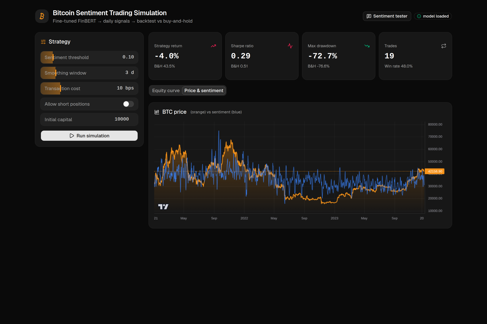
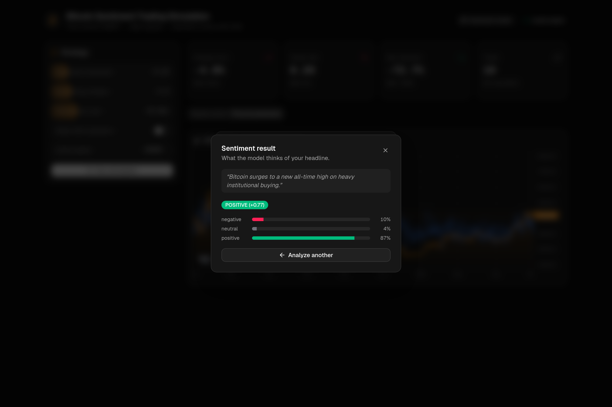

# 📊 Bitcoin Sentiment Trading Simulation

> An end-to-end NLP project that fine-tunes **FinBERT** to read Bitcoin news, turns daily sentiment into **trading signals**, and **backtests** the strategy against buy-and-hold on real BTC prices — served through a **FastAPI** backend and a polished **React** dashboard.

<p align="left">
  
  
  
  
  
</p>


---

## ✨ Features

- 🧠 **Fine-tuned FinBERT** — 3-class sentiment (negative / neutral / positive) trained on Financial PhraseBank
- 📰 **Real data** — ~14k dated Bitcoin headlines + real BTC-USD daily prices (yfinance)
- 📈 **Honest backtest** — no look-ahead (today's news → tomorrow's return), with transaction costs
- ⚖️ **Strategy vs Buy-and-Hold** — total return, CAGR, Sharpe, max drawdown, win rate, trade count
- 🎛️ **Interactive dashboard** — tune threshold, smoothing, costs, short-selling; charts update instantly
- 💬 **Live sentiment tester** — type any headline and see the model's verdict (stacked dialog UI)
- ⚡ **Fast** — sentiment is precomputed & cached, so simulations return in ~0.2s

---

## 🏗️ Architecture

```
┌──────────────────┐      ┌───────────────────────┐      ┌──────────────────────┐
│  GOOGLE COLAB    │      │   FASTAPI BACKEND     │      │   REACT FRONTEND     │
│  (train, once)   │      │   (inference + sim)   │      │   (dashboard)        │
│                  │ model│                       │ JSON │                      │
│ fine-tune FinBERT├─────▶│ /predict  /simulate   │◀────▶│ charts + controls    │
│ export model.zip │ files│ /prices   (+ cache)   │ HTTP │ + sentiment tester   │
└──────────────────┘      └───────────────────────┘      └──────────────────────┘
     cloud / GPU              backend/ :8000                 frontend/ :5173
```

**Pipeline:** `news text → FinBERT sentiment → daily signal → backtest → equity curve vs buy-and-hold`

---

## 🚀 Quick start

```bash
git clone https://github.com/thealihamza04/bitcoin-sentiment-trading-simulation.git
cd bitcoin-sentiment-trading-simulation

./setup.sh     # one-time: backend venv + deps, frontend deps
# add the trained model to backend/model/  (see "The model" below)
./run.sh       # starts backend (:8000) + frontend (:5173)
```

Then open **http://localhost:5173**.

> Prefer manual control? See [Manual setup](#-manual-setup) below.

---

## 🧠 The model

The fine-tuned FinBERT weights (~438 MB) are **not** committed to git. Two ways to get them:

1. **Train it yourself** — open the notebook in [`colab/`](colab/) on a GPU runtime, run it, and download `finbert-finetuned.zip`.
2. Unzip its contents into `backend/model/` so the folder contains `config.json`, `model.safetensors`, `tokenizer.json`, etc. (see [`backend/model/README.md`](backend/model/README.md)).

The backend auto-detects the model on startup — `GET /` reports `"model_loaded": true`.

---

## 🖼️ Screenshots

| Price & sentiment | Live sentiment tester |
|---|---|
|  |  |

---

## 🧩 Tech stack

**Backend** · FastAPI · PyTorch (CPU) · 🤗 Transformers (FinBERT) · pandas · yfinance · HuggingFace Datasets
**Frontend** · React + Vite · Tailwind v4 + shadcn/ui · Recharts + TradingView lightweight-charts · TanStack Query · Framer Motion · lucide-react · sonner

---

## 📂 Repository layout

```
.
├── colab/                  # Stage 1 — training notebook (train, test, export)
├── backend/                # Stage 2 — FastAPI inference + simulation
│   ├── app/
│   │   ├── main.py         #   API endpoints + CORS
│   │   ├── sentiment.py    #   load model, predict
│   │   ├── data.py         #   yfinance prices + HF news (cached)
│   │   ├── signals.py      #   sentiment → position {-1,0,+1}
│   │   ├── backtest.py     #   simulation + metrics
│   │   └── precompute.py   #   score all headlines once → cache
│   ├── model/              #   ← trained FinBERT goes here (gitignored)
│   └── requirements.txt
├── frontend/               # Stage 3 — React + Vite dashboard
│   └── src/
│       ├── App.jsx · api.js · hooks.js
│       └── components/     #   Controls, charts, SentimentTester, ui/
├── setup.sh                # one-command install
└── run.sh                  # start backend + frontend together
```

---

## 🔌 API

| Method | Endpoint | Description |
|---|---|---|
| `GET` | `/` | Health + `model_loaded` flag |
| `POST` | `/predict` | `{ "text": "…" }` → label + probabilities + sentiment score |
| `GET` | `/prices` | BTC-USD daily price history |
| `GET` | `/simulate` | Run the backtest (threshold, smoothing, cost, etc.) → metrics + equity curve |

Interactive docs at **http://localhost:8000/docs**.

---

## 🛠️ Manual setup

```bash
# Backend
cd backend
python3 -m venv .venv && source .venv/bin/activate
pip install torch --index-url https://download.pytorch.org/whl/cpu   # CPU build
pip install -r requirements.txt
uvicorn app.main:app --reload          # http://localhost:8000

# Frontend (new terminal)
cd frontend
npm install
npm run dev                            # http://localhost:5173
```

Optional: pre-score all headlines so the first simulation is instant:
```bash
cd backend && python -m app.precompute
```

---

## ⚠️ Notes & honest caveats

- This is a **backtest** on historical data (2021–2023), not live trading — past performance doesn't guarantee future results.
- Simplifications: all-in / all-out positions, simple transaction-cost model, no slippage, daily decisions.
- `ProsusAI/finbert` was originally trained on Financial PhraseBank, so re-fine-tuning mainly demonstrates the training pipeline; a clean train/val/test split keeps the metrics meaningful.
- Whether the sentiment strategy beats buy-and-hold depends on the parameters — finding that out *is* the experiment. 🙂

---

## 📄 License

MIT — feel free to use, learn from, and build on this.
