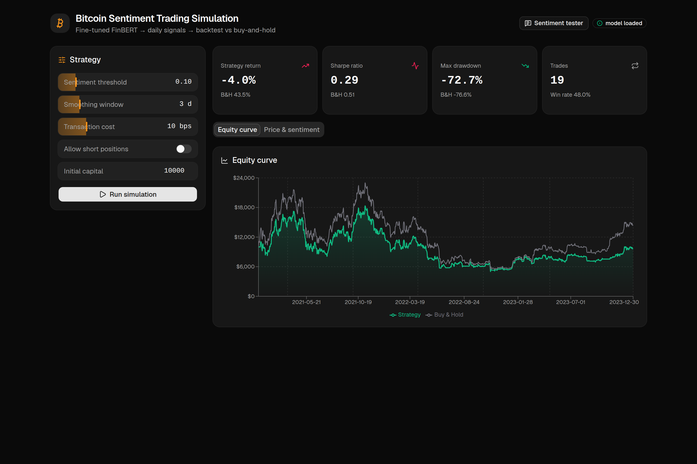

<!--
  Bitcoin Sentiment Trading Simulation — presentation deck.
  Render with Marp (https://marp.app):  marp docs/SLIDES.md --pdf
  or the "Marp for VS Code" extension → Export.
-->

# 📊 Bitcoin Sentiment Trading Simulation

### Can reading the news beat just holding Bitcoin?

An NLP project: **FinBERT** reads crypto headlines → trading signals → backtest

<br>

*by thealihamza04*

---

## The big question

> If a computer read crypto news every day and **bought when the mood was good** and **sold when it was bad**…
>
> …would it have made more money than someone who **just held Bitcoin**?

This project **builds that system** and **tests it on real history**.

---

## The idea in one picture

```
   NEWS HEADLINE          SENTIMENT         SIGNAL          SIMULATION
"Bitcoin surges..."   →   +0.8 (good)   →   BUY      →   replay on real
"Crypto crashes..."   →   -0.7 (bad)    →   SELL         BTC prices, day
                          (an AI model)     (a rule)      by day → profit?
```

Three ingredients: **AI sentiment** · **a trading rule** · **a backtest**

---

## 1️⃣ The AI — FinBERT

- **FinBERT** = a BERT language model specialised in **financial text**
- We **fine-tuned** it to classify a sentence as
  **negative / neutral / positive**
- Trained & evaluated on a held-out test set
  (accuracy, F1, confusion matrix)

🧠 *It reads a headline the way a human analyst would — and outputs a score.*

---

## 2️⃣ The signal

Each day we:

1. Score every headline → average into one **daily sentiment**
2. Smooth it (reduce noise)
3. Apply a simple rule:

```
sentiment >  threshold  →  BUY / hold Bitcoin
sentiment < -threshold  →  SELL / stay in cash
```

---

## 3️⃣ The simulation (backtest)

- Start with **$10,000** of pretend money
- Replay **real BTC prices (2021–2023)** day by day
- **No cheating:** today's news → *tomorrow's* return (no peeking ahead)
- Deduct **transaction costs**
- Compare against **Buy & Hold** 📈

---

## 🎬 Live demo

<!-- Switch to the browser at http://localhost:5173 -->

1. Tune the **strategy sliders**
2. Hit **Run simulation** → watch Strategy vs Buy & Hold
3. Read the **metrics** (return, Sharpe, drawdown)
4. Open the **Sentiment tester** → type a headline live



---

## Is the data real?

| Part | Real? |
|---|---|
| Bitcoin prices | ✅ actual market data (yfinance) |
| News headlines | ✅ ~14,000 real dated headlines |
| Sentiment scores | ✅ produced by our fine-tuned model |
| Backtest math | ✅ honest, no look-ahead |

It's **real historical data** — a genuine experiment, not a mock-up.
*(It's a backtest, not live trading.)*

---

## How it's built — 3 tiers

```
COLAB (train)  ─model─▶  FASTAPI (backend)  ─JSON─▶  REACT (dashboard)
 GPU, one time            inference + sim            charts + controls
```

**Stack:** PyTorch · 🤗 Transformers · FastAPI · React · Tailwind + shadcn/ui · Recharts + TradingView

---

## What we learned

- Building an **end-to-end ML product**: data → model → API → UI
- **Honest evaluation** matters (test split + no look-ahead)
- Simple sentiment **doesn't always beat buy-and-hold** —
  and *finding that out* is the real result ✅

---

# Thank you! 🙌

**GitHub:** github.com/thealihamza04/bitcoin-sentiment-trading-simulation

Questions?
